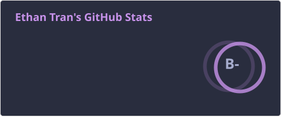

# Hi, I'm Ethan Tran

A full-stack computer science junior at California State University - Sacramento, I love designing, developing, and optimizing high-performance infrastructure, parallelizable architecture, and scalable data pipelines.

## About Me

[](https://visitor-badge.laobi.icu/badge?page_id=quwin.quwin)
[](https://www.linkedin.com/in/kien-ethan-tran/)
[](https://quwin.dev)
[](mailto:ethantran@quwin.dev)
[](https://github.com/quwin/quwin/blob/main/profile/Ethan%20Tran%20Resume.pdf)
[](https://github-readme-stats.vercel.app/api?username=quwin&hide_title=false&hide_border=true&show_icons=true&include_all_commits=true&line_height=20&bg_color=0,EC6C6C,FFD479,FFFC79,73FA79&theme=graywhite&locale=cn)
[](https://github.com/quwin?tab=followers)

## Technology Stack

### Languages

<p>
  
</p>

### Full-Stack

<p>
  
</p>

### Cloud, DevOps & Infrastructure

<p>
  
</p>

### Databases, Data & AI

<p>
  
</p>

## Stats

<!--  -->

<!--START_SECTION:waka-->


**🐱 My GitHub Data** 

> 🏆 388 Contributions in the Year 2026
 > 
> 📦 853.6 kB Used in GitHub's Storage 
 > 
> 💼 Opted to Hire
 > 
> 📜 38 Public Repositories 
 > 
> 🔑 15 Private Repositories  
 > 
**I'm an Early 🐤** 

```text
🌞 Morning    214 commits    █████████░░░░░░░░░░░░░░░░   37.15% 
🌆 Daytime    173 commits    ███████░░░░░░░░░░░░░░░░░░   30.03% 
🌃 Evening    175 commits    ███████░░░░░░░░░░░░░░░░░░   30.38% 
🌙 Night      14 commits     ░░░░░░░░░░░░░░░░░░░░░░░░░   2.43%

```
📅 **I'm Most Productive on Tuesday** 

```text
Monday       78 commits     ███░░░░░░░░░░░░░░░░░░░░░░   13.54% 
Tuesday      102 commits    ████░░░░░░░░░░░░░░░░░░░░░   17.71% 
Wednesday    82 commits     ███░░░░░░░░░░░░░░░░░░░░░░   14.24% 
Thursday     83 commits     ███░░░░░░░░░░░░░░░░░░░░░░   14.41% 
Friday       58 commits     ██░░░░░░░░░░░░░░░░░░░░░░░   10.07% 
Saturday     71 commits     ███░░░░░░░░░░░░░░░░░░░░░░   12.33% 
Sunday       102 commits    ████░░░░░░░░░░░░░░░░░░░░░   17.71%

```


📊 **This Week I Spent My Time On** 

```text
💬 Programming Languages: 
Python                   4 hrs 34 mins       ████████████████░░░░░░░░░   63.61% 
Markdown                 1 hr 19 mins        ████░░░░░░░░░░░░░░░░░░░░░   18.39% 
Git Config               22 mins             █░░░░░░░░░░░░░░░░░░░░░░░░   5.2% 
Text                     19 mins             █░░░░░░░░░░░░░░░░░░░░░░░░   4.46% 
JSON                     10 mins             ░░░░░░░░░░░░░░░░░░░░░░░░░   2.4%

🐱‍💻 Projects: 
DenPAR_kpt_mapping       3 hrs 4 mins        ██████████░░░░░░░░░░░░░░░   42.73% 
adaptive-choice          1 hr 39 mins        █████░░░░░░░░░░░░░░░░░░░░   23.12% 
domain-agent-updater     45 mins             ██░░░░░░░░░░░░░░░░░░░░░░░   10.51% 
perio_kpt_parser         34 mins             ██░░░░░░░░░░░░░░░░░░░░░░░   8.03% 
ML-Perio-Bone-Loss-Detect30 mins             █░░░░░░░░░░░░░░░░░░░░░░░░   7.16%

```

**I Mostly Code in Python** 

```text
Python                   9 repos             ███████░░░░░░░░░░░░░░░░░░   28.12% 
Rust                     7 repos             █████░░░░░░░░░░░░░░░░░░░░   21.88% 
C++                      3 repos             ██░░░░░░░░░░░░░░░░░░░░░░░   9.38% 
Java                     3 repos             ██░░░░░░░░░░░░░░░░░░░░░░░   9.38% 
HTML                     2 repos             █░░░░░░░░░░░░░░░░░░░░░░░░   6.25%

```


 Last Updated on 11/08/2026
<!--END_SECTION:waka-->

<!--
**quwin/quwin** is a ✨ _special_ ✨ repository because its `README.md` (this file) appears on your GitHub profile.

Here are some ideas to get you started:

- 🔭 I’m currently working on ...
- 🌱 I’m currently learning ...
- 👯 I’m looking to collaborate on ...
- 🤔 I’m looking for help with ...
- 💬 Ask me about ...
- 📫 How to reach me: ...
- 😄 Pronouns: ...
- ⚡ Fun fact: ...
-->
